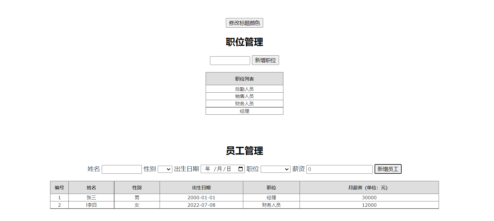

# 百度前端大作业项目

[TOC]

**南京大学 软件学院 201250063 靳琦清**

### 项目简介

一个基于Vue开发的简单的员工管理系统，包含职位管理和员工管理两个模块。

### 运行环境

- node v16.14.2

- npm v8.5.0

以上环境是作者编写和测试时使用的环境，不代表不支持其他环境。

### 使用说明

命令行进入项目根目录下，输入npm run dev启动项目，访问http://localhost:8080使用（具体端口视命令行内的提示）

``` bash
# install dependencies
npm install

# serve with hot reload at localhost:8080
npm run dev

# build for production with minification
npm run build

# build for production and view the bundle analyzer report
npm run build --report
```

### 代码框架

```java
baidu_web_project
├─ README.md           			//说明文档  
├─ index.html
├─ package.json
├─ src
│    ├─ App.vue
│    ├─ assets
│    ├─ components
│    │    └─ HelloWorld.vue
│    ├─ employee
│    │    └─ Employee.vue     	//主页面，实现了简单的员工管理
│    ├─ main.js
│    └─ router
│           └─ index.js
└─ static
       └─ .gitkeep
```

### 界面展示



### 功能介绍

- 新增职位和职位展示功能

- 新增员工和员工列表显示功能

- 修改标题颜色功能

### 代码说明

主要代码在/src/employee/Employee.vue中

#### 1. MVVM架构

View视图通过html标签的使用完成，Model中数据的申明和相关的方法在script中定义。

通过Vue.js来实现MVVM中View Model层功能，将View的视图和Model的数据连接和绑定起来，具体上即v-model、v-bind、{{data}}等的使用。

#### 2. 数据劫持和发布订阅模式

依靠Vue中采用的Object.defineProperty的getter和setter来进行数据劫持。

发布订阅模式是在用getter和setter劫持时，使用Observer（数据监听器）对数据对象的所有属性进行监听，如果发生变动，将通知所有的Watcher（订阅者），Watcher的维护通过Dep（消息订阅器）完成，此外还有一个Complier来解析指令。

#### 3. 单向绑定

**方式一：插值形式**

使用{{data}}的方法完成单向绑定，一但Model中的值发生改变，View中相应改变。

例如：对于职位的显示，Model中addPost()会改变postList的值，使得View中对postList的视图相应改变。

```html
<template>
    <table class="gridtable" width="200">
      <thead>
         <tr>
           <th class="column">职位列表</th>
         </tr>
      </thead>
      <tbody>
         <tr v-for="item in postList" :key="item">
           <td>{{item}}</td>
         </tr>
       </tbody>
    </table>
</template>

<script>
export default {
    name: 'EmployeeManagement',
    data(){
      return{
          postList: ['后勤人员', '销售人员', '财务人员', '经理'],
          postInfo: null,
          ...
      }
    }
    methods:{
      addPost () {
      	this.postList.push(this.postInfo);
      },
      ...
    }
}
</script>
```

**方式二：v-bind形式**

使用{{data}}的方法完成单向绑定，一但Model中的值发生改变，View中相应改变。

例如，对于标题"员工管理"的颜色，使用v-bind绑定到Model中的titleColor，当改变titleColor时，View中标题的颜色就会改变。

```html
<template>
    <button v-on:click="changeTitleColor">修改标题颜色</button>

    <h2 v-bind:class="titleColor">员工管理</h2>
</template>

<script>
export default {
    name: 'EmployeeManagement',
    data(){
      return{
       titleColor: 'black',
       ...
      }
    }
    methods: {
      changeTitleColor () {
          if (this.titleColor === 'black') {
            this.titleColor = 'red'
          } else if (this.titleColor === 'red') {
            this.titleColor = 'black'
      },
      ...
    }
}
</script>
<style>
  .black{
    color: black;
  }
  .red {
    color: red;
  }
</style>
```

#### 4. 双向绑定

使用v-model完成双向绑定，View中修改数据会改变Model中的值，同样在Model中修改数据也会改变View中的值。

例如：对于新增职位一项，View中输入的数据与Model中的postInfo绑定，再调用addPost()，将postInfo的值加入postList中，然后View中对应的postList的视图就会得到更新。

```html
<template>
    <div>
        <input type="text" class="inputItem" size="10px" v-model = "postInfo">   
        <button v-on:click="addPost">新增职位</button>  
    </div>
</template>

<script>
export default {
    name: 'EmployeeManagement',
    data(){
      return{
          postList: ['后勤人员', '销售人员', '财务人员', '经理'],
          postInfo: null,
          ...
      }
    }
    methods:{
      addPost () {
      	this.postList.push(this.postInfo);
      },
      ...
    }
}
</script>
```

#### 参考文章

| 文章名                        | 作者       | 地址                                                       |
| ----------------------------- | ---------- | ---------------------------------------------------------- |
| 【Vue】vue 单向绑定& 双向绑定 | vickylinj  | https://www.cnblogs.com/vickylinj/p/13707112.html          |
| Vue学习--MVVM模型             | 故事很长、 | https://blog.csdn.net/qq_41761591/article/details/87621440 |

